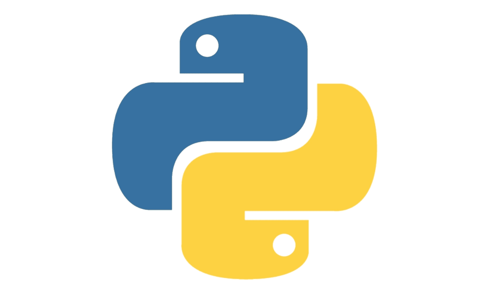

# 🌟 Mini-Projets Tkinter

Bienvenue dans ce dépôt contenant plusieurs petits projets réalisés avec **Tkinter**, la bibliothèque d'interface graphique native de Python.

Tkinter permet de créer des interfaces utilisateur de manière simple et rapide, tout en restant relativement légère. Ces projets sont principalement conçus pour l'apprentissage ou l’expérimentation.

